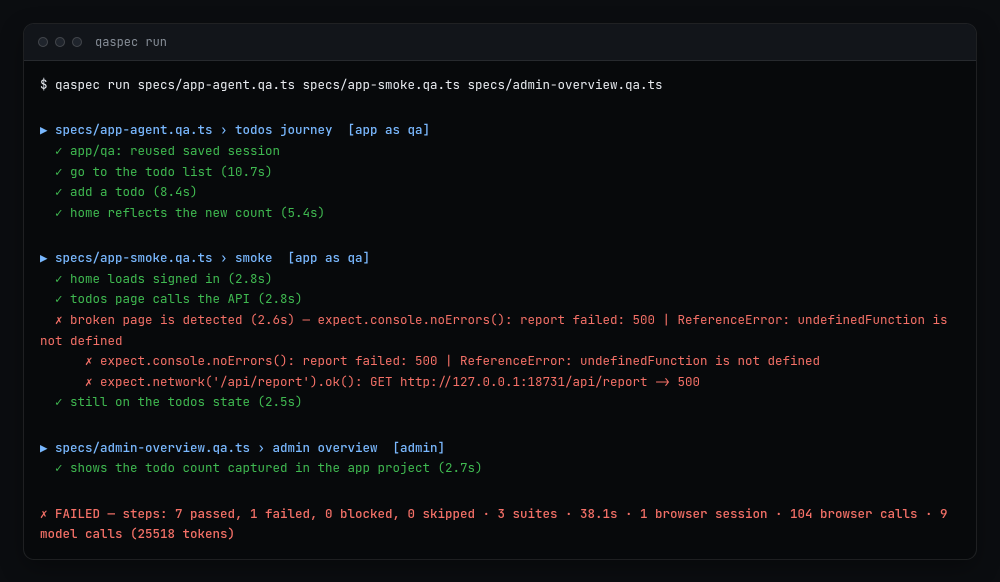
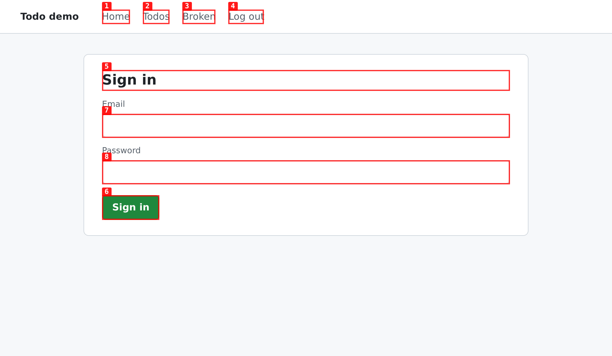
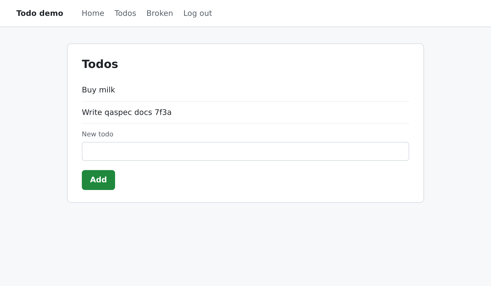
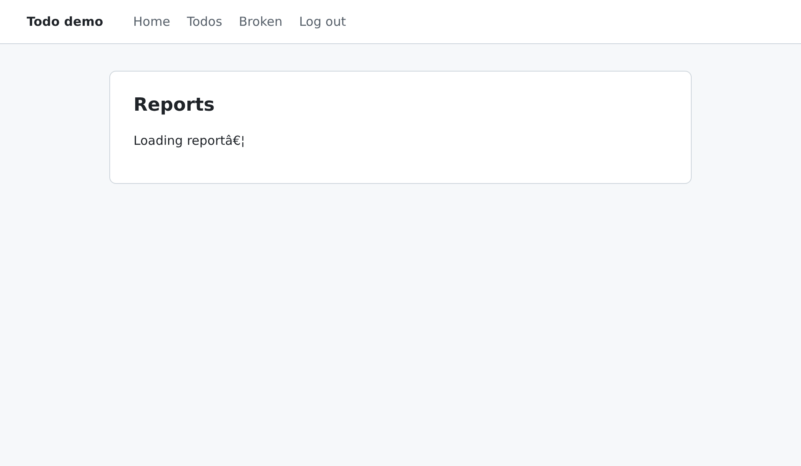
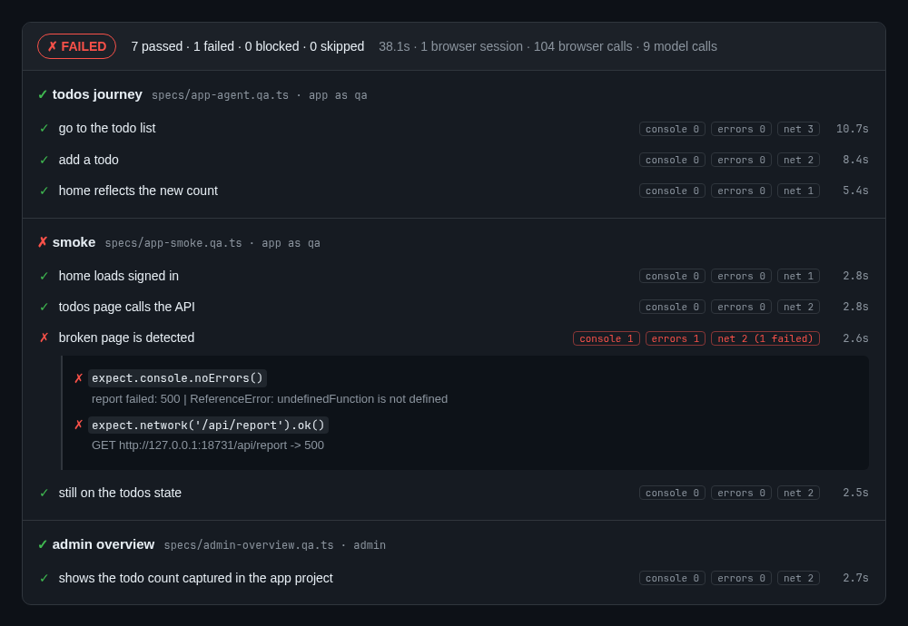
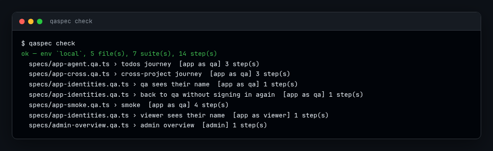
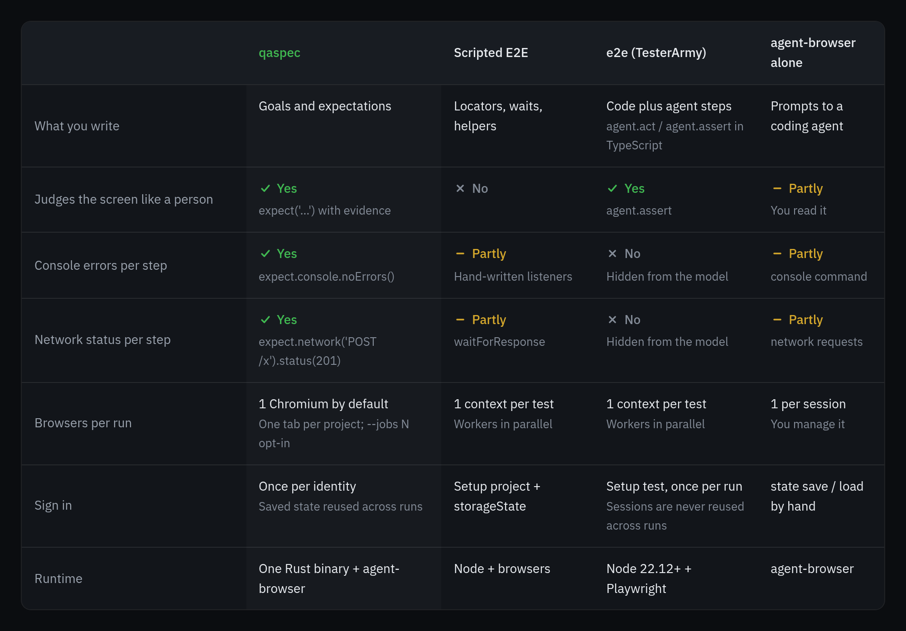
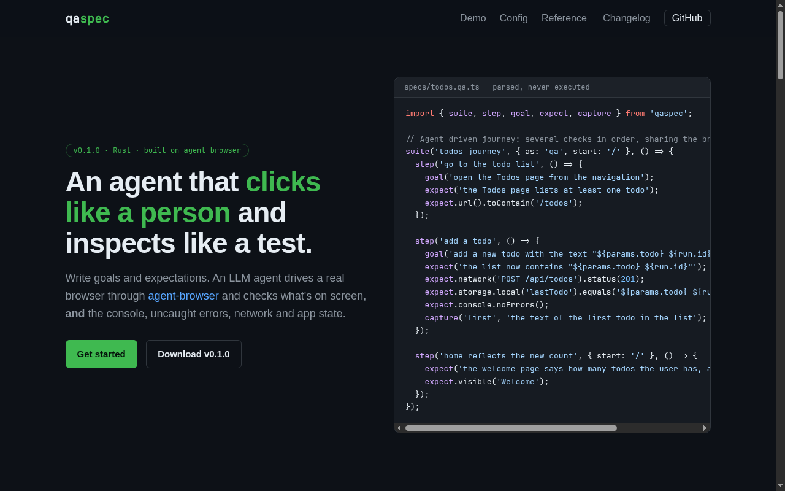
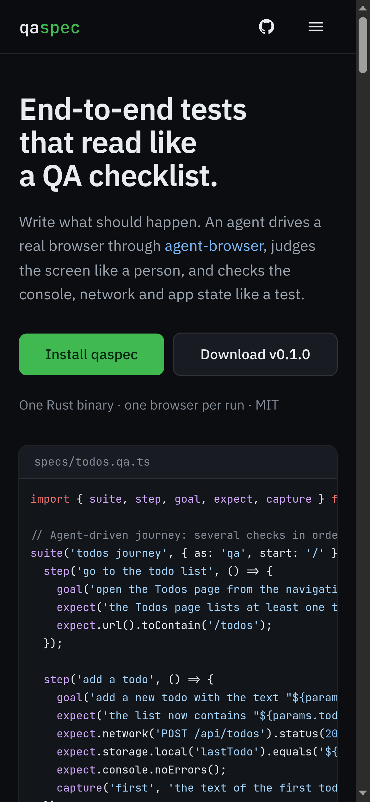

# qaspec

**Agentic end-to-end specs.** Write *what* a QA engineer would check — goals and expectations —
and an LLM agent drives a real browser through [agent-browser](https://github.com/vercel-labs/agent-browser)
to do it, checking the screen **and** the console, uncaught errors, network and app state.

```ts
// specs/todos.qa.ts — TypeScript syntax, but it is never executed: qaspec reads it as a declaration.
import { suite, step, goal, expect, capture } from 'qaspec';

suite('todos journey', { project: 'app', as: 'qa', start: '/' }, () => {
  step('go to the list', () => {
    goal('open the Todos page from the navigation');
    expect('the Todos page lists at least one todo');        // judged by the LLM, with evidence
    expect.url().toContain('/todos');                        // deterministic, no model call
  });

  step('add a todo', () => {                                 // continues where the last step left off
    goal('add a todo with the text "${params.todo} ${run.id}"');
    expect('the list now contains "${params.todo} ${run.id}"');
    expect.network('POST /api/todos').status(201);
    expect.storage.local('lastTodo').equals('${params.todo} ${run.id}');
    expect.console.noErrors();                               // only errors raised during THIS step
    capture('first', 'the text of the first todo');          // reusable later as ${first}
  });

  step('home shows the count', { start: '/' }, () => {       // `start` makes a step independent
    expect('the welcome page says the user has more than 1 todo');
  });
});
```

<p align="center">
  <a href="https://jaivial.github.io/qaspec/"></a>
</p>

**Website:** https://jaivial.github.io/qaspec/ (it includes an interactive viewer for the report of this run).

## Why

Classic E2E tests are slow to write (locators, waits, helpers) and blind to what they don't assert.
A human QA reasons about what they see, but can't read the console or the network while clicking.
Agentic frameworks such as `e2e` keep the model away from those signals by design.
qaspec sits in between: **an agent that clicks like a person and inspects like a test.**

- **One file, many checks in order.** A `suite` is a journey of `step`s that share the browser state.
  A failed step skips only the steps that depend on its state.
- **One Chromium for the whole run.** A Chromium session costs about 1.5 GB of memory, so qaspec never
  runs browsers in parallel. Each project gets its own tab, and the session is reused across suites.
- **Sign in once.** Identities sign in once (with a login spec, or the agent does it by itself). The
  state is saved under `.qaspec/state/` with mode 600 and reused across runs until it expires.
- **Replay cache.** A goal that passed (and whose expectations passed) is recorded as browser
  actions with semantic locators. If the UI is unchanged, the next run replays them and makes **zero
  model calls** for that goal; if the UI moved, the agent takes over and the recording is rewritten.
- **Mobile web.** A suite can run on an emulated phone (`suite('x', { device: 'iPhone 14' })`), and
  the agent is told the window is small so it scrolls and opens menus instead of hovering.
- **Config, not code.** Base URLs per environment, credentials as secrets, params, the device a
  suite runs on, and projects that depend on each other all live in `qaspec.toml`.
- **Secrets stay secret.** The model only sees secret *names*. Values are typed through
  agent-browser's stdin, never argv, and redacted from every log and report.
- **Single Rust binary.** agent-browser is the only runtime dependency.

## What it looks like

These screenshots come from a real run against the demo app in [`tests/fixtures/app`](tests/fixtures/app).

| 1. Sign in once | 2. Reach the goal | 3. Catch what looks fine |
|---|---|---|
|  |  |  |
| agent-browser labels every control. The agent types the username and uses `fill_secret` for the password, so it never sees it. The session is saved for the next run. | For `goal('add a todo …')` the agent fills the input and presses Add. qaspec checks that `POST /api/todos` returned 201 and that no console error fired during the step. | The page looks fine, but its script throws and its API returns 500. `expect.console.noErrors()` fails the step. |

The report of that run, rendered on the website, with the failing step expanded:



`qaspec check` validates specs, config, identities and secrets without opening a browser:



## How it compares

Regular E2E is a scripted Playwright or Cypress suite. Agentic E2E is [e2e by TesterArmy](https://github.com/tester-army/e2e).

| | qaspec | Regular E2E | Agentic E2E (TesterArmy) |
|---|:---:|:---:|:---:|
| Tests written without selectors | ✅ | ❌ | ✅ (mixed with locators) |
| Survives UI changes without edits | ✅ | ❌ | ✅ |
| Judges the screen like a person | ✅ | ❌ | ✅ |
| The model sees console errors | ✅ | ❌ | ❌ |
| The model sees network requests | ✅ | ❌ | ❌ |
| Console and network checks built in | ✅ | ❌ | ❌ |
| Ordered checks sharing browser state | ✅ | ✅ | ✅ |
| Sign-in reused across runs | ✅ | ✅ | ❌ (once per run) |
| One browser for the whole run | ✅ | ❌ | ❌ |
| Dependent apps: health, order, shared data | ✅ | ❌ | ❌ |
| Passwords never reach the model | ✅ | ✅ (no model) | ✅ |
| Runs without calling a model | ✅ (exact checks + replay cache) | ✅ | ✅ (from the cache) |
| Replay cache for unchanged UI | ✅ | ✅ (no model) | ✅ |
| Parallel workers | ❌ | ✅ | ✅ |
| Mobile web (device emulation) | ✅ | ✅ | ❌ |
| Mobile apps (iOS, Android) | ❌ | ✅ (Appium, Detox) | ✅ |
| Single binary, no Node runtime | ✅ | ❌ | ❌ |

In detail, with agent-browser on its own as a fourth column:



| | qaspec | Scripted E2E (Playwright, Cypress) | [e2e](https://github.com/tester-army/e2e) (TesterArmy) | agent-browser alone |
|---|---|---|---|---|
| What you write | Goals and expectations | Locators, waits, helpers | TypeScript with `agent.act` / `agent.assert` | Prompts to a coding agent |
| Survives UI changes | Yes, the agent finds the control again | No, selectors break | Yes, plus a replay cache | If you re-prompt |
| Judges the screen like a person | Yes, `expect('…')` quotes evidence | No | Yes, `agent.assert` | You read it |
| Console errors per step | Yes, `expect.console.noErrors()` | Hand-written listeners | Hidden from the model | `console` command |
| Network status per step | Yes, `expect.network(…).status(…)` | `waitForResponse` | Hidden from the model | `network requests` |
| Browsers per run | 1 Chromium, one tab per project | A context per test, parallel workers | A context per test, parallel workers | One per session, by hand |
| Sign in | Once per identity, reused across runs | Setup project + `storageState` | Setup test, once per run (sessions are never reused across runs) | `state save` / `load` by hand |
| Several dependent apps | `depends_on`, health checks, captures | Projects, by hand | Targets | No |
| Mobile web | `device: 'iPhone 14'` per suite/project/browser, and the agent is told to scroll and use menus | `devices['iPhone 14']` by hand | Not built in | `set device`, by hand |
| Runtime | One Rust binary + agent-browser | Node + browsers | Node 22.12+ + Playwright | agent-browser |
| Model calls | Every goal and judged check the first time, then only the judged checks | None | Fewer after the first run | Every step |

Based on the e2e 0.16 and agent-browser 0.27 docs, and on porting a real two-app suite. Corrections are welcome as issues.

## Install

```bash
npm i -g agent-browser && agent-browser install     # the browser driver (one-time)
cargo install --git https://github.com/jaivial/qaspec --tag v0.1.0
```

Prebuilt Linux and macOS binaries are attached to each [GitHub release](https://github.com/jaivial/qaspec/releases).

## Quick start

```bash
qaspec init          # writes qaspec.toml + specs/home.qa.ts and ignores .qaspec/
qaspec check         # parse specs, validate config, secrets and identities — no browser
qaspec run           # run everything in one browser session
qaspec run specs/todos.qa.ts --env dev --set params.todo="Buy bread" --headed
qaspec run --keep-open   # leave the browser up; the next run reuses it (session qaspec-<env>)
qaspec run --cache strict  # CI: a missing or stale recording is a failure, never a model call
qaspec state list    # saved sign-ins; `qaspec state clear app.qa` forces a new login
```

Exit codes: `0` passed, `1` a step failed, `2` blocked (environment, credentials, LLM), `3` usage/config error.
Reports are written to `.qaspec/report.json` (`--json PATH`), and `--junit PATH` adds JUnit XML for CI.

## `qaspec.toml`

```toml
default_env = "local"                       # or --env / QASPEC_ENV

[projects.app]
specs  = "specs/app/**/*.qa.ts"             # suites in these files belong to `app`
health = "/health"                          # failing health => the project's suites are `blocked`
locale = "es-ES"                            # hint for the agent
[projects.app.env.local]
base_url = "http://localhost:3000"
[projects.app.env.dev]
base_url = "https://dev.example.com"

[projects.app.identities.qa]
username = "qa@example.com"
password = { file = "~/.config/qaspec/app-password" }  # or { env = "APP_PW" } / { value = "..." }
secrets  = { otp_seed = { env = "APP_OTP" } }          # more secrets for fill_secret
login    = "specs/_login.qa.ts"             # optional: without it the agent signs in by itself
valid_if = { url_not = "/login" }           # or { js = "!!window.currentUser" }

[projects.admin]
specs = "specs/admin/**/*.qa.ts"
depends_on = ["app"]                        # run after app; blocked if app is down
device = "Pixel 7"                          # mobile web: this project's suites run on a phone
[projects.admin.env.local]
base_url = "http://localhost:4000"

[params]
todo = "Write docs"
[env.dev.params]
todo = "Write docs (dev)"

[llm]                                       # any OpenAI-compatible endpoint with tool calls
base_url = "https://api.openai.com/v1"
api_key  = { env = "OPENAI_API_KEY" }
actor    = "gpt-4.1-mini"                   # drives the browser
judge    = "gpt-4.1-mini"                   # judges expect('...') (defaults to actor)

[browser]
headed = false
# session = "my-session"                    # attach to an existing agent-browser session
device = "iPhone 14"                        # default device for every suite (see "Mobile web")
# viewport = [390, 844, 3]                  # or an explicit [width, height, scale]
```

Precedence, from lowest to highest: the file, then `[env.<env>]`, then `QASPEC_PARAM_<NAME>` /
`QASPEC_<PROJECT>_BASE_URL`, then `--set`. You can override `params.<name>`,
`projects.<p>.base_url`, `projects.<p>.device`, `llm.base_url`, `llm.actor`, `llm.judge`,
`browser.headed` and `browser.device`.

## Spec reference

| Call | Meaning |
|---|---|
| `suite(name, { project?, as?, start?, device?, viewport? }, () => {...})` | A journey. `as` = identity, `start` = first URL (default `/`), `device` / `viewport` = run it on an emulated phone (see [Mobile web](#mobile-web)). |
| `step(name, { start?, onFail?, needs?, project?, as? }, () => {...})` | One verdict. Inherits the browser state unless `start` is given. `onFail`: `stop` (default; later state-dependent steps are skipped), `continue`, `abort`. `needs`: earlier steps that must have passed. A `project` change opens that project's tab. |
| `goal(text)` | The agent acts until the goal is reached (`passed`/`failed`/`blocked`). |
| `expect(text)` | The LLM judges the screen + this step's signals and must quote evidence. |
| `expect.console.noErrors()` | No `console.error` and no uncaught error during the step. |
| `expect.errors.none()` | No uncaught page error during the step. |
| `expect.network(pattern).status(code)` / `.ok()` / `.called()` | Requests during the step. Pattern: `[METHOD] /path` with `*` (one segment) and `**`. |
| `expect.network.noFailures()` | No request answered `>= 400`. |
| `expect.url().toContain(s)` / `.not.toContain(s)` / `.toBe(s)` | Current URL. |
| `expect.state(js).equals(v)` / `.toBeTruthy()` / `.toBeFalsy()` | A JS expression evaluated in the page. |
| `expect.visible(text)` / `expect.not.visible(text)` | Text present in the page. |
| `expect.storage.local(key).equals(v)` / `.exists()` | `localStorage`. |
| `capture(name, description)` / `capture.state(name, js)` / `capture.url(name)` | Stores a value as `${name}` for later steps and files. |

Placeholders: `${params.x}`, `${project.base_url}`, `${projects.<p>.base_url}`, `${identity.username}`,
`${run.id}` (unique per run), `${env}` and any captured `${name}`. Secrets are never interpolated.

Within a step, deterministic expectations run before the judged ones, so a failing check does not spend
a model call. Anything outside this subset (`if`, `const`, `await`, variables, etc.) is rejected with
`file:line:col`.

## Mobile web

A suite can run on an emulated phone or tablet. Native apps are out of scope, but mobile **web** is
not: agent-browser emulates the device (size, pixel ratio and user agent) and qaspec tells the agent
to behave as on a phone, so it scrolls and opens hamburger menus instead of hunting for links that
the small layout hides.

```ts
suite('checkout', { project: 'shop', as: 'buyer', device: 'Pixel 7' }, () => {
  step('the cart page fits a phone', { start: '/cart' }, () => {
    expect.state('window.innerWidth').equals(412);
    goal('open the menu and go to Shipping');
  });
});
```

```toml
[browser]                  # every suite
device = "iPhone 14"
viewport = [390, 844, 3]   # or [width, height, scale]

[projects.shop]            # only this project's suites
device = "Pixel 7"
```

**Precedence is `suite` > `project` > `browser`.** The most specific level that sets anything wins
completely: a suite with `device` does not keep the project's `viewport`, because a device already
implies its own metrics. `qaspec check` prints what each suite will run on:

```
specs/checkout.qa.ts > checkout  [shop as buyer] 4 step(s)  on Pixel 7
```

The device is applied before the suite's first step and fully undone after it, so a run that mixes
a phone suite with a desktop suite still runs the desktop one at desktop size **with the desktop
user agent** (see below). Only the tab the suite
drives is touched (agent-browser applies emulation per target). If agent-browser does not know the
device, the suite is `blocked` and reports the names it accepts.

### What `set device` really does (agent-browser 0.27, measured)

Measured with agent-browser 0.27 on Chromium, reading `navigator` and `innerWidth` from the page:

| | size | `devicePixelRatio` | user agent | `navigator.maxTouchPoints` |
|---|---|---|---|---|
| no emulation | 1280x577 | 1 | desktop Chrome | 0 |
| `set device "iPhone 14"` | 390x844 | 3 | `... (iPhone; CPU iPhone OS 16_0 ...) Mobile/15E148 Safari/604.1` | 0 |
| `set viewport 390 844 3` | 390x844 | 3 | **unchanged** (desktop) | 0 |

- **`set device` changes the user agent; `set viewport` does not.** A suite that needs the app to
  serve the mobile bundle (a different header, a different layout branch) needs `device`, not
  `viewport`. `set viewport` only resizes the window, and it reports `mobile: false` while every
  device reports `mobile: true`.
- **Touch events are not emulated.** `navigator.maxTouchPoints` stays 0 and
  `matchMedia('(pointer: coarse)')` stays false with both commands: agent-browser sends mouse events
  and has no `Emulation.setTouchEmulationEnabled` in 0.27. So a spec can prove the *layout* is
  mobile, but it cannot prove that a gesture handler reacts to a real tap. Use `agent-browser tap`
  when a spec needs a touch gesture. For the same reason qaspec tells the agent it is driving a
  phone-sized window **with the mouse** (and that the user agent is a mobile one), never that it
  can tap: what a phone-sized layout really needs is scrolling and menu buttons, and that advice
  holds either way.
- **A page without `<meta name="viewport">` lays out at 980px**, exactly as on a real phone, no
  matter the emulation. If `window.innerWidth` is 980 instead of 390, the app is missing the meta
  tag — that is a finding about the app, not a broken emulation.
- **Device names.** agent-browser lists `iPhone 15, iPhone 16, iPhone 16 Pro, iPhone 17, iPad,
  iPad Pro, Pixel 9, Galaxy S25` when it rejects a name, but it also accepts any device from the
  Playwright catalogue, case-insensitively (`iPhone 12`, `Pixel 7`, `Galaxy S21`, `Pixel 5` all work).
  `set device` applies to the active tab only, and new tabs start with the last window size but the
  desktop user agent — so qaspec applies the device to the suite's tab after switching to it.
- **There is no "clear emulation"** in agent-browser 0.27, no desktop device name to undo a
  `set device` with, and a device's user-agent override survives a later `set viewport`. Restoring
  the size alone is not enough: a later desktop suite would still be served `... iPhone ...`, so a
  spec asserting `navigator.userAgent.includes("iPhone")` is falsy would fail even though the
  window is 1280 wide. qaspec therefore undoes both: it reads the window size before it emulates
  anything, writes it back with `set viewport`, and drops the user-agent override with the global
  `--user-agent ""` (an empty override means "use the browser's real user agent"). Both are applied
  to every tab the run emulated, and both survive navigation and later tabs.
  `tests/fixtures/app/specs/app-desktop-after-mobile.qa.ts` is the regression test for this.
- **iOS Simulator (`-p ios`) is not implemented**: it needs Xcode and only runs on macOS. On Linux
  and CI, `set device` gives a mobile Chromium with the iOS user agent.

### Deterministic mobile checks

`tests/fixtures/app/specs/app-mobile.qa.ts` is a runnable example (no model call):

```
▶ specs/app-mobile.qa.ts › mobile  [app as qa]
  ▶ viewport: iPhone 14
  ✓ app/qa: reused saved session
  ✓ the page runs at the size of the emulated phone (5.1s)
  ✓ the app is served the mobile user agent (1.2s)
  ✓ the navigation still works on a small screen (3.1s)
  ↩ viewport restored (1280x577)

✓ PASSED — steps: 3 passed, 0 failed, 0 blocked, 0 skipped · 1 suites · 10.9s · 1 browser session
```

## How it works

```
qaspec run
 └─ agent-browser --session qaspec-<run>         one Chromium for every suite
     ├─ tab "app"    ← identity app/qa  (state: .qaspec/state/<env>/app.qa.json)
     └─ tab "admin"
```

1. Plan: suites are ordered by project dependency, then grouped by identity.
2. Each project is health-checked once. Dependencies that are down make dependents `blocked`.
3. Each identity is restored from saved state and checked with `valid_if`. If that fails, the
   identity signs in again and the new state is saved, filtered to that project's host.
4. Each step marks the signal window, navigates if it has `start`, then runs goals, expectations and captures.
5. The agent's tools map one-to-one to agent-browser commands: snapshot, click, fill, type, press,
   select, hover, scroll, open, back, wait, read_console, read_network, eval, fill_secret and done.
6. Before a goal, the replay cache is consulted (§ Replay cache). Otherwise the agent drives the
   browser, and a passing step records what it did.

## Replay cache

The second run of an unchanged app costs no model calls for its goals. qaspec stores, per goal that
passed **with all of its expectations passing**, the sequence of browser actions the agent performed
in `.qaspec/cache/<env>/<sha>.json` (mode 600).

- **Key** = hash of project, identity, spec file, suite, step, the goal text after interpolation
  (`${run.id}` put back as the placeholder, so the same goal always keys the same way) and a
  fingerprint of the page the goal starts from: the URL path plus the roles and accessible names of
  the interactive snapshot. Steps share browser state, so that starting page is part of the key.
- **No ephemeral refs.** An `@e7` is stored as a semantic locator — role + accessible name, plus an
  index when the page has several with the same name — and replayed with agent-browser's
  `find role <tag> <action> --name "<name>"` (`find label`, `find nth` and the tag alone are tried as
  fallbacks, because `find --name` is unreliable on some tags in 0.27).
- **Secrets stay secret.** `fill_secret` is recorded as the secret *name* only; the value is read at
  replay time and typed through agent-browser's stdin, never in argv and never in the cache file.
- **Values follow the run.** `${params.x}`, `${run.id}` and captures keep their placeholders in the
  recording and are resolved with the *current* run's values, so a replay reaches the same state the
  expectations of this run ask about.
- **Self-healing.** If a replayed action cannot be located, the agent continues from the current page
  and the recording is rewritten. `--cache strict` turns a missing or stale recording into a failure
  (`CACHE_MISSING` / `CACHE_REPLAY_FAILED`) with zero model calls, which is what CI wants.
- `--cache off` disables it. The JSON report marks each goal item with `"cache":
  "replayed" | "recorded" | "agent"`, and the terminal prints `(replayed)` on those steps.

## Examples

- [`examples/shop`](examples/shop): a storefront and its back office. Two projects with `depends_on`,
  two identities (one with a login spec, one signed in by the agent), a checkout journey with
  captures, and a back-office suite that uses the captured order number and switches back to the store tab.
- [`tests/fixtures/app`](tests/fixtures/app): a tiny runnable app (Python stdlib) with the suites used
  to validate qaspec end to end, including `app-mobile.qa.ts`, which runs on an emulated iPhone 14.

## Status

`0.1.0` is the first usable release. The [`plan/`](plan/) folder holds the analysis and the roadmap:
judge-verdict caching, an iOS Simulator provider (needs Xcode and macOS; mobile web already works
with `set device`),
cross-project captures with `needs` between files, and identity switching inside one project
(implemented, not yet battle-tested).

## Website

 

The site in [`site/`](site/) is built with Svelte 5 and Vite, and deployed to GitHub Pages
(`gh-pages` branch) by `.github/workflows/pages.yml`. It renders a real `report.json` and the run output
from `site/src/data/`, and imports the example specs straight from the repo.

```bash
cd site && npm ci && npm run dev          # http://localhost:5173/qaspec/
npm run build && npm run preview          # production build
```

The README screenshots come from the site's `?shot=run|report|spec|check|checks|compare` views, captured with agent-browser
(see [`site/README.md`](site/README.md)).

## Development

```bash
cargo test                                   # unit tests (parser, config, planner, matching)
python3 tests/fixtures/app/server.py 18731 & python3 tests/fixtures/app/server.py 18732 admin &
cd tests/fixtures/app && QASPEC_FIXTURE_PASSWORD=s3cret-pass QASPEC_LLM_KEY=... qaspec run
```

The fixture's `app-smoke` suite deliberately fails one step (`/broken` raises a console error and a 500).

## License

MIT
